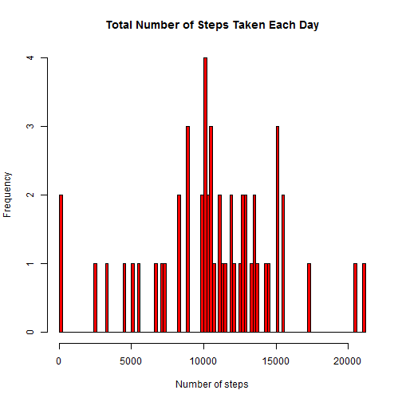
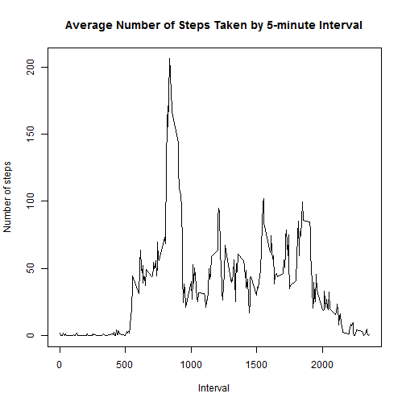
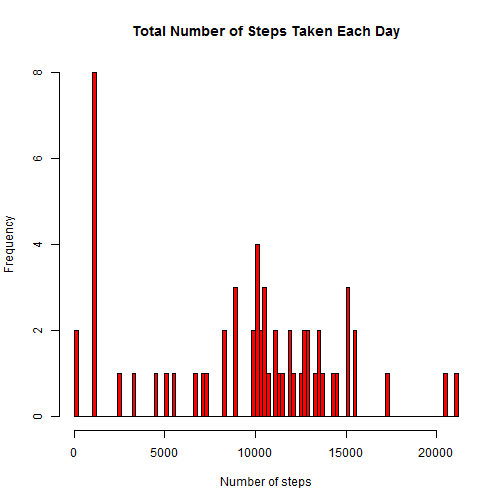
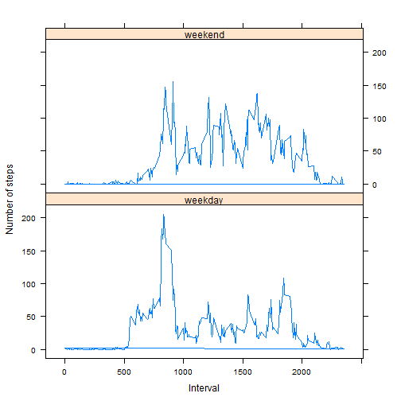

# Reproducible Research: Peer Assessment 1


## Loading and preprocessing the data

```r
data <- read.csv(unz("activity.zip", "activity.csv"))
```


## What is mean total number of steps taken per day?

```r
totalSteps <- tapply(data$steps, data$date, sum)
totalSteps <- as.data.frame(totalSteps)
totalSteps["date"] <- rownames(totalSteps)
totalSteps <- totalSteps[complete.cases(totalSteps), ]

hist(x = totalSteps$totalSteps, breaks = 100, col = "red", main = "Total Number of Steps Taken Each Day", 
    xlab = "Number of steps")
```

 


The mean total number of steps taken per day is

```r
mean(totalSteps$totalSteps)
```

```
## [1] 10766
```


while the median total number of steps taken per day is

```r
median(totalSteps$totalSteps)
```

```
## [1] 10765
```


## What is the average daily activity pattern?

```r
meanSteps <- tapply(data$steps, data$interval, mean, na.rm = TRUE)
meanSteps <- as.data.frame(meanSteps)
meanSteps["interval"] <- rownames(meanSteps)

plot(x = meanSteps$interval, y = meanSteps$meanSteps, type = "l", main = "Average Number of Steps Taken by 5-minute Interval", 
    xlab = "Interval", ylab = "Number of steps")
```

 


The 5-minute interval, on average across all the days in the dataset, 
that contains the maximum number of steps is the 835 5-minute interval.

```r
meanSteps[meanSteps$meanSteps == max(meanSteps$meanSteps), ]
```

```
##     meanSteps interval
## 835     206.2      835
```


## Imputing missing values
The total number of missing values in the dataset (i.e. the total number of 
rows with NAs) is

```r
sum(is.na(data$steps))
```

```
## [1] 2304
```

  
All of the missing values in the dataset are filled in by using the median for 
that 5-minute interval. First, the median for each 5-minute interval is 
calculated:

```r
medianSteps <- tapply(data$steps, data$interval, median, na.rm = TRUE)
medianSteps <- as.data.frame(medianSteps)
medianSteps["interval"] <- rownames(medianSteps)
```


Then we clone the original dataset to a new dataset and fill the missing values 
in the new dataset:

```r
newData <- data
for (row in 1:nrow(newData)) {
    if (is.na(newData$steps[row])) {
        interval <- newData$interval[row]
        steps <- medianSteps[medianSteps$interval == interval, 1]
        newData$steps[row] <- steps
    }
}
```


To check whether the mean and median total number of steps taken per day now 
differ from the estimates from the first part of the assignment we use the same 
code as used in the first part. The only thing that has to be changed is 'data' 
to 'newData'.


```r
totalSteps <- tapply(newData$steps, newData$date, sum)
totalSteps <- as.data.frame(totalSteps)
totalSteps["date"] <- rownames(totalSteps)
totalSteps <- totalSteps[complete.cases(totalSteps), ]

hist(x = totalSteps$totalSteps, breaks = 100, col = "red", main = "Total Number of Steps Taken Each Day", 
    xlab = "Number of steps")
```

 


The mean total number of steps taken per day is now

```r
mean(totalSteps$totalSteps)
```

```
## [1] 9504
```


while the median total number of steps taken per day is now

```r
median(totalSteps$totalSteps)
```

```
## [1] 10395
```


And yes, we see the mean and median differ for the first part. So the impact of 
imputing missing data on the estimates of the total daily number of steps is 
that the mean and median change.

## Are there differences in activity patterns between weekdays and weekends?

```r
library("lattice")

newData["dayType"] <- weekdays(as.Date(newData$date))
weekdays <- unique(newData$dayType)
newData$dayType <- ifelse(newData$dayType %in% weekdays[6:7], newData$dayType <- "weekend", 
    newData$dayType <- "weekday")
newData$dayType <- as.factor(newData$dayType)

meanSteps <- tapply(newData$steps, newData[c("interval", "dayType")], mean, 
    na.rm = TRUE)
meanSteps <- as.data.frame(meanSteps)
meanSteps["interval"] <- rownames(meanSteps)

for (row in 1:nrow(newData)) {
    interval <- newData$interval[row]
    dayType <- newData$dayType[row]
    steps <- meanSteps[meanSteps$interval == interval, ifelse(dayType == "weekday", 
        1, 2)]
    newData$steps[row] <- steps
}

xyplot(steps ~ interval | dayType, data = newData, type = "l", layout = c(1, 
    2), main = "", ylab = "Number of steps", xlab = "Interval")
```

 

